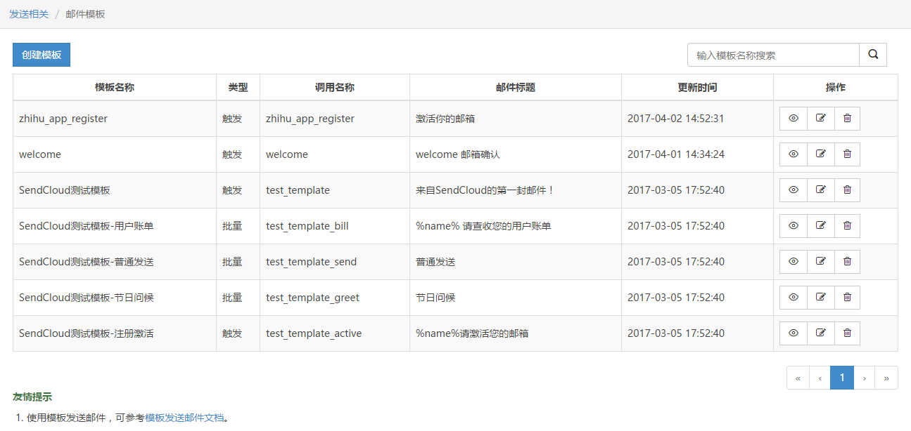
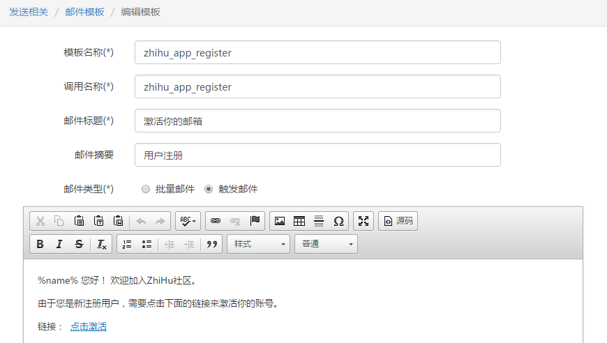

#用户注册

https://github.com/NauxLiu/Laravel-SendCloud

composer require naux/sendcloud

修改 config/app.php，添加服务提供者
```
'providers' => [
   // 添加这行
    Naux\Mail\SendCloudServiceProvider::class,
];
```

在 .env 中配置你的密钥， 并修改邮件驱动为 sendcloud
```
MAIL_DRIVER=sendcloud
MAIL_FROM_ADDRESS=jiezeal@163.com
MAIL_FROM_NAME='jiezeal'
SEND_CLOUD_USER=zhulinjie_test_2vMozD
SEND_CLOUD_KEY=3wEdZsIpxzwO1Wj5
```





模版源码
```
<p><span id="9999" style="display: none !important; font-size:0; line-height:0">用户注册</span></p>

<p>%name% 您好！ 欢迎加入ZhiHu社区。</p>

<p>由于您是新注册用户，需要点击下面的链接来激活你的账号。</p>

<p>链接：&nbsp; <a href="%url%" target="_blank">点击激活</a></p>
```

php artisan make:auth

web.php
```
Route::get('email/verify/{token}', ['as'=>'email.verify', 'uses'=>'EmailController@verify']);
```

php artisan make:controller EmailController

app/Http/Controllers/Auth/RegisterController.php
```
use Naux\Mail\SendCloudTemplate;

/**
 * Create a new user instance after a valid registration.
 *
 * @param  array  $data
 * @return User
 */
protected function create(array $data)
{
    $user =  User::create([
        'name' => $data['name'],
        'email' => $data['email'],
        'avatar' => '/images/avatars/default.jpg',
        'confirmation_token' => str_random(40),
        'password' => bcrypt($data['password']),
    ]);

    $this->sendVerifyEmailTo($user);

    return $user;
}

/**
 * @param $user
 */
private function sendVerifyEmailTo($user)
{
    $data = [
        'url' => route('email.verify', ['token'=>$user->confirmation_token]),
        'name' => $user->name
    ];

    $template = new SendCloudTemplate('zhihu_app_register', $data);

    Mail::raw($template, function ($message) use ($user) {
        $message->from(env('MAIL_FROM_ADDRESS'), env('MAIL_FROM_NAME'));
        $message->to($user->email);
    });
}
```