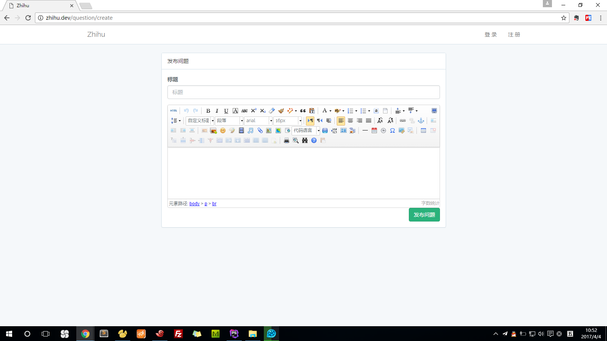

#发布问题

参考资料：
>Laravel-UEditor：https://github.com/overtrue/laravel-ueditor

composer require "overtrue/laravel-ueditor:~1.0"

添加下面一行到 config/app.php 中 providers 部分：
```
Overtrue\LaravelUEditor\UEditorServiceProvider::class,
```

发布配置文件与资源
```
php artisan vendor:publish
```

web.php
```
Route::resource('question', 'QuestionController', ['names'=>[
    'create' => 'question.create'
]]);
```

php artisan make:controller QuestionController --resource

QuestionController.php
```
/**
 * Display a listing of the resource.
 *
 * @return \Illuminate\Http\Response
 */
public function index()
{
    return 'index';
}

/**
 * Show the form for creating a new resource.
 *
 * @return \Illuminate\Http\Response
 */
public function create()
{
    return view('questions.create');
}
```

views/questions/create.blade.php
```
@extends('layouts.app')

@section('content')
    @include('vendor.ueditor.assets')
    <div class="container">
        <div class="row">
            <div class="col-md-8 col-md-offset-2">
                <div class="panel panel-default">
                    <div class="panel-heading">发布问题</div>

                    <div class="panel-body">
                        <form action="/question" method="post">
                            {!! csrf_field() !!}
                            <div class="form-group">
                                <label for="title">标题</label>
                                <input type="text" name="title" class="form-control" id="title" placeholder="标题">
                            </div>
                            <!-- 编辑器容器 -->
                            <script id="container" name="body" type="text/plain"></script>
                            <button class="btn btn-success pull-right" type="submit">发布问题</button>
                        </form>
                    </div>
                </div>
            </div>
        </div>
    </div>
    <!-- 实例化编辑器 -->
    <script type="text/javascript">
        var ue = UE.getEditor('container');
        ue.ready(function() {
            ue.execCommand('serverparam', '_token', '{{ csrf_token() }}'); // 设置 CSRF token.
        });
    </script>
@endsection
```


web.php
```
Route::resource('question', 'QuestionController', ['names'=>[
    'create' => 'question.create',
    'show' => 'question.show',
]]);
```

