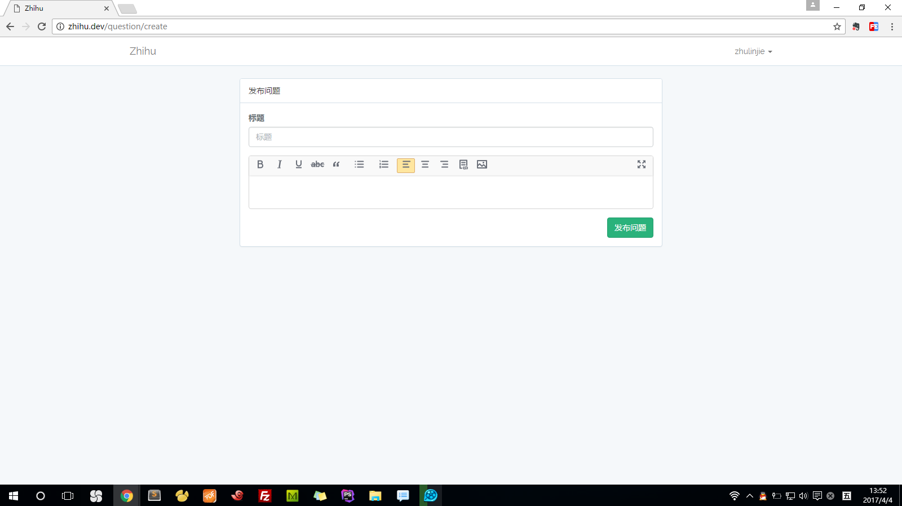

#美化编辑器

参考资料：
>Ueditor 的简化版本：https://github.com/JellyBool/simple-ueditor  
>UEditor配置：http://fex.baidu.com/ueditor/#start-config

clone代码：
```
git clone https://github.com/JellyBool/simple-ueditor.git
```

用此项目的 ueditor 目录替换原来的 public/vendor/ueditor 目录

实例化编辑器的时候配置 toolbar ，主要是 toolbar 的配置
views/questions/create.blade.php
```
<!-- 实例化编辑器 -->
<script type="text/javascript">
    var ue = UE.getEditor('container', {
        toolbars: [
            ['bold', 'italic', 'underline', 'strikethrough', 'blockquote', 'insertunorderedlist', 'insertorderedlist', 'justifyleft','justifycenter', 'justifyright',  'link', 'insertimage', 'fullscreen']
        ],
                elementPathEnabled: false,
                enableContextMenu: false,
                autoClearEmptyNode:true,
                wordCount:false,
                imagePopup:false,
                autotypeset:{ indent: true,imageBlockLine: 'center' }
    });
    ue.ready(function() {
        ue.execCommand('serverparam', '_token', '{{ csrf_token() }}'); // 设置 CSRF token.
    });
</script>
```


QuestionController.php
```

```