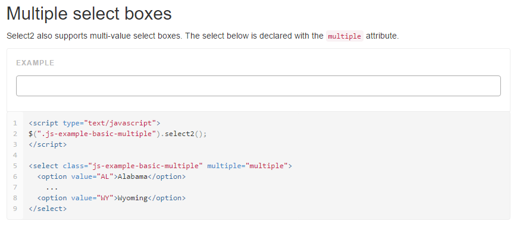

#使用 Select2 优化话题选择

>http://select2.github.io/

cd resources/assets/css
```
wget https://cdnjs.cloudflare.com/ajax/libs/select2/4.0.3/css/select2.min.css
```

cd resources/assets/js
```
wget https://cdnjs.cloudflare.com/ajax/libs/select2/4.0.3/js/select2.min.js
```

resources/assets/js/bootstrap.js
```
require('./select2.min');
```

resources/assets/sass/app.scss
```
@import "../css/select2.min";
```

gulp

http://select2.github.io/examples.html



views/layouts/app.blade.php
```
@yield('js')
```

views/questions/create.blade.php
```
<div class="form-group">
    <select class="js-example-basic-multiple form-control" multiple="multiple">
        <option value="AL">Alabama</option>
        <option value="WY">Wyoming</option>
    </select>
</div>

@section('js')
    <!-- 实例化编辑器 -->
    <script type="text/javascript">
        var ue = UE.getEditor('container', {
            toolbars: [
                ['bold', 'italic', 'underline', 'strikethrough', 'blockquote', 'insertunorderedlist', 'insertorderedlist', 'justifyleft','justifycenter', 'justifyright',  'link', 'insertimage', 'fullscreen']
            ],
            elementPathEnabled: false,
            enableContextMenu: false,
            autoClearEmptyNode:true,
            wordCount:false,
            imagePopup:false,
            autotypeset:{ indent: true,imageBlockLine: 'center' }
        });
        ue.ready(function() {
            ue.execCommand('serverparam', '_token', '{{ csrf_token() }}'); // 设置 CSRF token.
        });

        $(".js-example-basic-multiple").select2();
    </script>
@stop
```

gulpfile.js
```
mix.version(['js/app.js', 'css/app.css']);
```

views/layouts/app.blade.php
```
<link href="{{ elixir('css/app.css') }}" rel="stylesheet">
<script src="{{ elixir('js/app.js') }}"></script>
```

gulp


